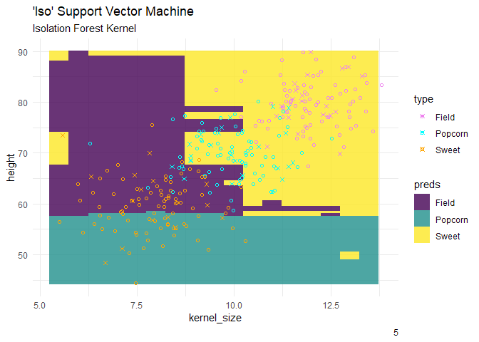
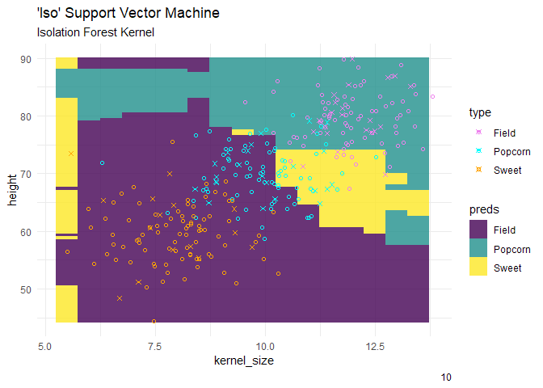
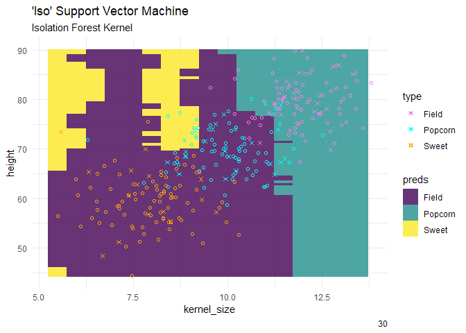
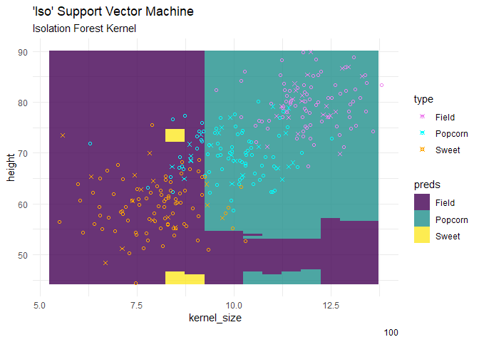
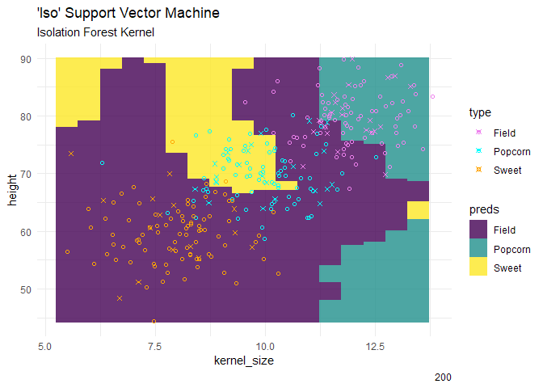
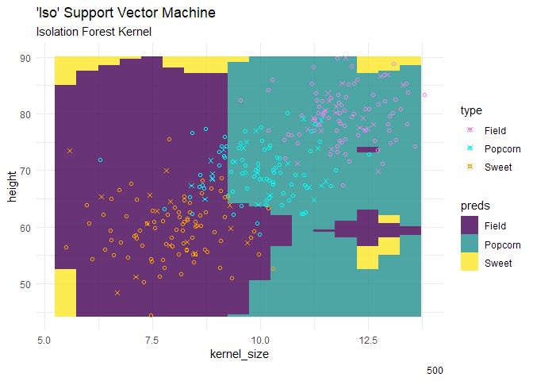

# {maize} package


# maize 

#### isolation.forest kernel sandbox

this is testing a precomputed kernel method using an isolation forest as
the kernel. simplifying the predictors into distance measurement then
solving for the label. this one is an open issue on the github looking
for a cleaner feasible solution. it requires passing and isolation
forest that needs run on the in- and out- of sample data after trained
on in-. adding a layer of complexity. additionally, it took many times
until this worked, changing the isolation.forest prediction mode, using
reference points, wrapping as.kernelMatrix() for kernlab to predict
properly.

``` r
# idea number 10 :)

library(isotree)
library(kernlab)
library(maize)
library(ggplot2)
```


    Attaching package: 'ggplot2'

    The following object is masked from 'package:kernlab':

        alpha

``` r
# use this later to create a classification field
# -----------------------------------------------
kernel_min <- corn_data$kernel_size |> min()
kernel_max <- corn_data$kernel_size |> max()
kernel_vec <- seq(kernel_min, kernel_max, by = .5)
height_min <- corn_data$height |> min()
height_max <- corn_data$height |> max() 
height_vec <- seq(height_min, height_max, by = .5)
corn_grid <- expand.grid(kernel_size = kernel_vec, height = height_vec)
# -----------------------------------------------


# creating a ksvm with a precomputed kernel using an isolation forest method. 
ksvm_iso_maize <- function(formula, data, C = 10, epsilon = .1, trees = 200) {
  
 resp_var <- all.vars(formula[[2]])
 resp_data <- data |> dplyr::select(tidyr::all_of(resp_var))
  
 pred_vars <- setdiff(names(data), resp_var) # this will need changed
 pred_data <- data |> dplyr::select(tidyr::all_of(pred_vars))
  
  iso_kernel <- isotree::isolation.forest(pred_data, 
                                   ntrees = trees, 
                                   missing_action = "impute")
  
  isotree.set.reference.points(iso_kernel, 
                               pred_data, 
                               with_distances = TRUE)

    k <- predict(iso_kernel, pred_data, type = "dist", # ?!?!?!
               use_reference_points = TRUE) 
  
    d <- 1 - k 
     d <- kernlab::as.kernelMatrix(d) # Bingo
   
      iso_ksvm <- kernlab::ksvm(x = d, y = dplyr::pull(resp_data), 
                                kernel = "matrix",
                                C = C, 
                                epsilon = epsilon)
  
  return(list(iso_ksvm = iso_ksvm, iso_kernel = iso_kernel))
}

# ksvm iso maize prediction function
predict_ksvm_iso_maize <- function(model_list, new_data) {
# model_list <- ksvm_iso_fit  
   iso_ksvm_model <- model_list$iso_ksvm
   iso_kernel <- model_list$iso_kernel
  
  kt <- predict(iso_kernel, new_data, type = "dist", 
               use_reference_points = TRUE)
  dt <- 1 - kt
  dt <- kernlab::as.kernelMatrix(dt) # finally works per Bingo
     iso_ksvm_preds <- predict(iso_ksvm_model, dt)
   
  return(iso_ksvm_preds)
}
```

### testing the isolation forest to see if it works

``` r
corn_train <- maize::corn_data |> dplyr::sample_frac(.8)
corn_test  <- maize::corn_data |> dplyr::anti_join(corn_train)
```

    Joining with `by = join_by(height, kernel_size, type)`

``` r
gg_diff_trees_ksvm_iso <- \(NTrees){
ksvm_iso_fit <- ksvm_iso_maize(type ~ ., data = corn_train, C = .8, trees = NTrees)

preds <- predict_ksvm_iso_maize(ksvm_iso_fit, corn_grid) 

iso_pred_df <- corn_grid |> cbind(preds)

corn_test |>
  ggplot() +
  geom_tile(inherit.aes = FALSE,
           data = iso_pred_df, 
           aes(x = kernel_size, y = height, fill = preds),
           alpha = .8) + 
  geom_point(inherit.aes = FALSE,
             data = corn_train,
             aes(x = kernel_size, y = height, color = type), shape = 1) +
  geom_point(aes(x = kernel_size, y = height, color = type), shape = 4) +
  theme_minimal() +
  labs(title = "'Iso' Support Vector Machine",
       subtitle = "Isolation Forest Kernel",
       caption = NTrees) +
  scale_fill_viridis_d() +
  scale_color_manual(values = c("violet", "cyan", "orange"))
}


gg_ls <- purrr::map(c(1, 5, 10, 30, 100, 200, 500), gg_diff_trees_ksvm_iso)
```

``` r
gg_ls
```

    [[1]]


    [[2]]




    [[3]]




    [[4]]




    [[5]]




    [[6]]




    [[7]]



?? 1) what
