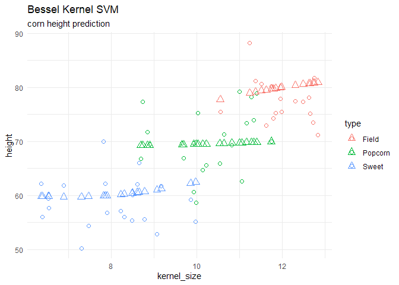
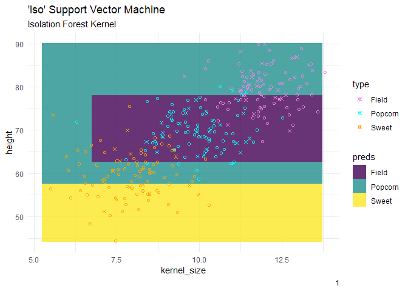

# {maize} package


# maize 

## what is {maize}?

{maize} is an extension library for support vector machines in
tidymodels! The package consists of additional kernel bindings listed in
{kernlab} that are not available in the {parsnip} package.

{parnsip} has three kernels available: linear, radial basis function, &
polynomial. {maize} binds five more {kernlab} kernels: laplace, bessel,
anova rbf, spline, & hyperbolic tangent. **Additionally, {maize} has a
few experimental kernels added in the most recent update: cauchy and
cossim. The goal is to add many more kernels compatible with kernlab and
parsnip.**

## Example Overview

### corn kernels and svm kernels

say we have three types of corn with different size kernels which create
different height corn. we could (1) create a support vector machine that
can predict the height of the corn given the kernel type and kernel
size, we could also (2) predict the corn type given the kernel size and
corn height.

#### corn kernel dataset

``` r
library(parsnip)
library(maize)
library(ggplot2)


# use this later to create a classification field
# -----------------------------------------------
kernel_min <- corn_data$kernel_size |> min()
kernel_max <- corn_data$kernel_size |> max()
kernel_vec <- seq(kernel_min, kernel_max, by = 1)
height_min <- corn_data$height |> min()
height_max <- corn_data$height |> max() 
height_vec <- seq(height_min, height_max, by = 1)
corn_grid <- expand.grid(kernel_size = kernel_vec, height = height_vec)
# -----------------------------------------------

maize::corn_data |>
    ggplot() +
    geom_point(aes(x = kernel_size, y = height, color = type)) +
    theme_minimal() +
    labs(title = 'corn kernel data') 
```


## Regression

### regression for corn kernel height given a specialty svm kernel

``` r
set.seed(31415)
corn_train <- corn_data |> dplyr::sample_frac(.80)
corn_test  <- corn_data |> dplyr::anti_join(corn_train)
```

    Joining with `by = join_by(height, kernel_size, type)`

``` r
# model params --
  svm_reg_spec <- 
    svm_bessel(cost = 1, margin = 0.1) |> 
    set_mode("regression") |>
    set_engine("kernlab")


# fit --

  svm_reg_fit <- svm_reg_spec |> fit(height ~ ., data = corn_train)
```

     Setting default kernel parameters  

``` r
# predictions --
preds <- predict(svm_reg_fit, corn_test)

# plot --
corn_test |>
  cbind(preds) |> 
    ggplot() +
    geom_point(aes(x = kernel_size, y = height, color = type), shape = 1, size = 2) +
    geom_point(aes(x = kernel_size, y = .pred,  color = type), shape = 2, size = 3) +
    theme_minimal() +
    labs(title = 'Bessel Kernel SVM',
         subtitle = "corn height prediction") 
```



## Classification

### classification of corn kernel type given a specialty svm kernel

``` r
# model params --
  svm_cls_spec <- 
    svm_laplace(cost = 1, margin = 0.1, laplace_sigma = 10) |> 
    set_mode("classification") |>
    set_engine("kernlab")
  
# fit --
  svm_cls_fit <- svm_cls_spec |> fit(type ~ ., data = corn_train)

# predictions --
preds <- predict(svm_cls_fit, corn_grid, "class")
pred_grid <- corn_grid |> cbind(preds)

# plot --
corn_test |>
  ggplot() +
  geom_tile(inherit.aes = FALSE,
            data = pred_grid, 
            aes(x = kernel_size, y = height, fill = .pred_class),
            alpha = .8) + 
  geom_point(aes(x = kernel_size, y = height, color = type, shape = type), size = 3) +
  theme_minimal() +
  labs(subtitle = "Laplacian Similarity Kernel") +
  scale_fill_viridis_d() +
  scale_color_manual(values = c("violet", "cyan", "orange"))
```



``` r
# model params --
  svm_cls_spec <- 
    svm_cossim(cost = 1, margin = 0.1) |> 
    set_mode("classification") |>
    set_engine("kernlab")
  
# fit --
  svm_cls_fit <- svm_cls_spec |> fit(type ~ ., data = corn_train)

# predictions --
preds <- predict(svm_cls_fit, corn_grid, "class")
pred_grid <- corn_grid |> cbind(preds)

# plot --
corn_test |>
  ggplot() +
  geom_tile(inherit.aes = FALSE,
            data = pred_grid, 
            aes(x = kernel_size, y = height, fill = .pred_class),
            alpha = .8) + 
  geom_point(aes(x = kernel_size, y = height, color = type, shape = type), size = 3) +
  theme_minimal() +
  labs(subtitle = "Cossim Similarity Kernel") +
  scale_fill_viridis_d() +
  scale_color_manual(values = c("violet", "cyan", "orange"))
```


``` r
# model params --
  svm_cls_spec <- 
    svm_anova_rbf(cost = 1, margin = 0.1) |> 
    set_mode("classification") |>
    set_engine("kernlab")
  
# fit --
  svm_cls_fit <- svm_cls_spec |> fit(type ~ ., data = corn_train)
```

     Setting default kernel parameters  

``` r
# predictions --
preds <- predict(svm_cls_fit, corn_grid, "class")
pred_grid <- corn_grid |> cbind(preds)

# plot --
corn_test |>
  ggplot() +
  geom_tile(inherit.aes = FALSE,
            data = pred_grid, 
            aes(x = kernel_size, y = height, fill = .pred_class),
            alpha = .8) + 
  geom_point(aes(x = kernel_size, y = height, color = type, shape = type), size = 3) +
  theme_minimal() +
  labs(subtitle = "ANOVA RBF Similarity Kernel") +
  scale_fill_viridis_d() +
  scale_color_manual(values = c("violet", "cyan", "orange"))
```


## future enhancements

additional kernels are always welcome & added periodically. The more
novel, the better, this is my hope for {maize}. Other enhancements
include adding *lssvm*, *rvm* and/or *kqr* engine bindings to parsnip.

## references

this package is based off the initial parsnip code, kernlab documents,
and tidymodels’ developer guides. The {maize} package is a corny pun of
{parsnip} & {kernels}, aw-shucks!

##### cheatsheets on how to register a model

- https://www.tidymodels.org/learn/develop/models/
- https://github.com/tidymodels/parsnip/blob/main/R/svm_linear.R
- https://github.com/tidymodels/parsnip/blob/main/R/svm_rbf.R
- https://github.com/tidymodels/parsnip/blob/main/R/svm_rbf_data.R

##### make function ideas, zzz.R,check_args,

- https://github.com/tidymodels/poissonreg/tree/main/R
- https://github.com/tidymodels/bonsai/tree/main/R

##### kernel parameters (kpar)

- https://github.com/cran/kernlab/blob/master/R/kernels.R
- https://www.rdocumentation.org/packages/kernlab/versions/0.9-32/topics/ksvm
